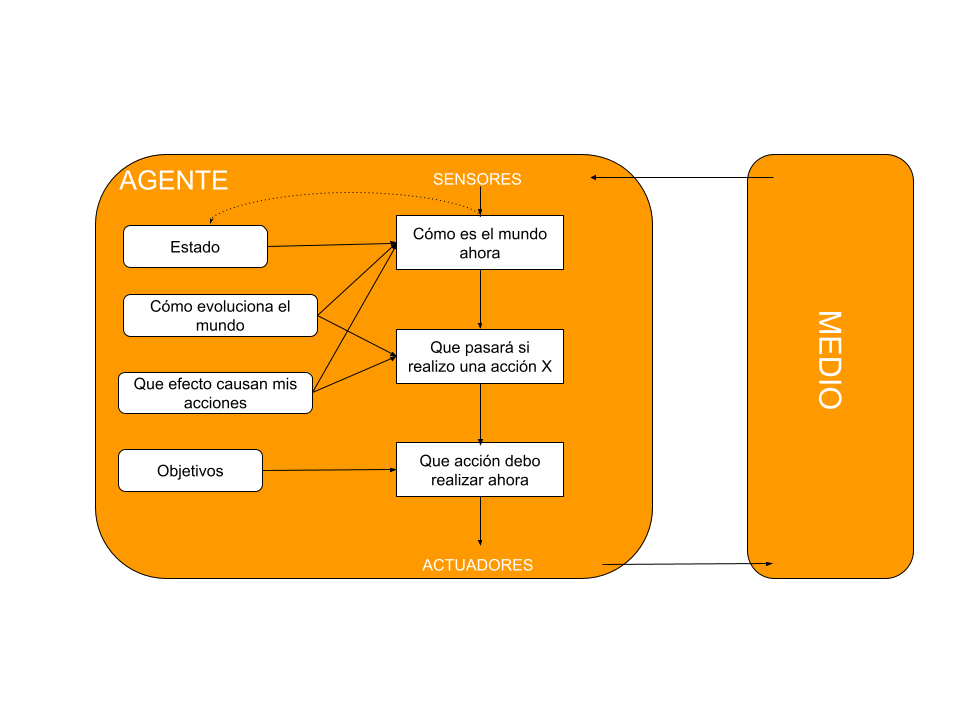

# **Quién es quién**
Práctica del curso de especialización de IA y Big Data - IES de Teis (Bruno Álvarez Darriba)

Este proyecto consiste en establecer una estrategia propia para poder resolver una partida del juego conocido como **"Quién es quién"**, usando *Prolog* y *Python*. Prolog será utilizado para poder establecer la base de datos, en la cual se establecerán los distintos personajes del panel y sus correspondientes características diferenciadoras, y también para desarrollar todo el código que permita simular la ejecución del juego. Python será empleado para todo el desarrollo y ejecución de los casos test (pytest).

 * [¿**"Quién es quién"** juego de *Optimización* o *Búsqueda*?](#¿"Quién-es-quién"-juego-de-Optimización-o-Búsqueda?)

 * [Entorno del agente](#Entorno-del-agente)

 * [Algoritmo](#Algoritmo)

 * [Estrutura del agente](#Estructura-del-agente)
 
 * [Uso del paradigma de programación lógica](#Uso-del-paradigma-de-programación-lógica)

 * [Prolog para la representación de la base de datos](#Prolog-para-la-representación-de-la-base-de-datos)

 * [Instalación y ejecución](#Instalación-y-ejecución) 

 * [Bibliografía](#Bibliografía)

## ¿**"Quién es quién"** juego de *Optimización* o *Búsqueda*?
Para poder primero decidir y defender una postura acerca de que tipo de problema es este que vamos a tratar, vamos a centrarnos en entender de que se trata cada uno de los problemas mencionados en el enunciado y sus principales diferencias: 

- **Problemas de optimización**: estos hacen referencia a aquellos problemas cuyo objetivo es encontrar el mejor estado según una función objetivo. En estos casos, no hay ningún tipo de \<coste de camino>.
Lo único importante es la configuración o estado final.

- **Problemas de búsquedas**: estos sin embargo hacen referencia a aquellos problemas los cuales han sido diseñados para explorar de manera sistemática los espacios de búsqueda, manteniendo en memoria uno o más caminos registrando los puntos que hayan sido explorados con anterioridad. Estos tipos de búsquedas son usados cuando importa el camino al objetivo. 

Como podemos observar, el problema con el que nos encontramos en el **"Quién es quién"** es claramente un problema de optimización. El objetivo principal de dicho juego es encontrar el personaje que le tocó a la otra persona en el menor número de preguntas posibles, por lo que el camino hasta llegar al resultado final de la partida nos da igual ya que lo que va a decidir quien gana es el hecho de hacer las mínimas preguntas y acertar el personaje. En otras palabras, buscamos minimizar la función objetivo que mide el número de preguntas necesarias para identificar al personaje. 

## Entorno del agente

Entorno de tareas | Completamente / parcialmente Observable| Agentes | Determinista / Estocástico | Episódico / Secuencial | Estático / Dinámico | Discreto / Continuo
:---: | :---: | :---: | :---: | :---: | :---: | :---: |
 Quién es quién | Parcialmente observable | Multiagente | Determinista | Secuencial | Estático | Discreto |

  
 
 - **Parcialmente observable:** los jugadores solo pueden ver su propio tablero, por lo que no conocen ni el tablero ni el personaje que tiene el rival el cual se tiene que adivinar descartando personajes de su propio tablero.

 - **Multiagente:** se trata de un agente multiagente ya que a la hora de estar jugando hay una relación directa con otro agente (a la hora de hacer las preguntas para poder descartar personajes en el tablero) pero no es adversario, la lucha es contra el propio juego, ya que el otro agente no está intentando minimizar tus acciones para poder lograr tu objetivo.

- **Determinista:** las preguntas que haces al otro agente van a tener respuestas concretas de si o no. No hay incertidumbre a la hora de responderlas.

- **Secuencial:** la decisión de hacer una pregunta u otra puede cambiar y afectar decisiones futuras. Por ejemplo, en función de la pregunta que se haga, el tablero cambia a un número mayor o menor de personajes. Por lo que cada iteracción con el otro agente va a depender de la anterior. Aparte de lo dicho, es un juego que se lleva a cabo de forma secuencial a la hora de hacer las preguntas, existen turnos para que cada agente las lleve a cabo.

- **Estático:** es estático ya que a la hora de estar pensando la pregunta que le vas a hacer al otro agente ni el entorno, ni el tablero ni el personaje a adivinar cambia.

- **Discreto:** los agentes tienen un número finito de personajes en su tablero. Al igual que las caracteríticas de los personajes y las respuestas de las preguntas tienen un número finito de posibilidades.

## Algoritmo
Tras analizar las distintas características de los personajes y sus frecuencias, me di cuenta que había varias de ellas que tenían una frecuencia mayor a las demás y pensé que sería buena idea coger esas. Después caí en que en el caso de que el personaje no tuviese esa característica que más se repite sería un muy buen movimiento, pero sería uno muy poco eficiente en caso contrario. Por lo que decidí coger la característica que ocupa la posición n (dividir la longitud de la lista de características entre dos) para así coger una característica que, sea la respuesta si o no, me quite un número parecido de personajes del tablero. 

## Estructura del agente
El tipo de agente escogido en este caso es un agente basado en objetivos. Esta elección fue tomada por varias razones:

1. En este juego el objetivo está totalmente claro, que es identificar el personaje del otro agente "contra" el que estamos jugando (recordemos que no es un agente adversario). Por lo que no es necesario que considere otros objetivos aparte de este, ya que sino aumentaría su complejidad.

2. Maneja mejor la incertidumbre en comparación con otros modelos de agente (basado en modelos y basado en utilidad), ya que se centra en un objetivo único.

3. Es más fácil de entender e implementar, ya que no existen funciones como la de utilidad, quizás difícil de encontrar y entender en algunos casos.

4. Es bastante flexible para poder usarlo en otros ámbitos o juegos. El cambio pasaría solo por cambiar el objetivo al que se prentende llegar.

## Uso del paradigma de programación lógica
Este juego es un buen ejemplo de problema para ser resuelto mediante el uso de la programación lógica por varios motivos: 

- Tiene unas reglas claras y definidas, lo cual es perfecto para el uso de reglas lógicas para modelar su funcionamiento. 

- Las preguntas se formulan en términos de características y relaciones entre los personajes, estas se pueden representar fácilmente mediante predicados y relaciones en lógica.

- El juego implica sacar conclusiones a partir de las respuestas a las preguntas planteadas por el otro agente. Por ejemplo, si se pregunta: "¿Tu personaje tiene el pelo negro?" y el otro agente recibe te da una respuesta negativa, entonces se puede deducir que todos los personajes con pelo negro pueden ser descartados de las opciones posibles. Dichas deducciones se expresan en la programación lógica mediante reglas.

- Toda la información sobre las características de cada personaje se puede almacenar y expresar mediante el uso de reglas lógicas también, ya que el propio paradigma es capaz de analizar, razonar y tratar dicha información para responder cualquier tipo de pregunta a cerca de la misma (devolviendo valores booleanos, personajes que cumplen las preguntas formuladas, listas...).

- Permite también aumentar las características y/o los personajes sin ningún tipo de problema de forma fácil e intuitiva. Aparte de que también es una buena opción para tratar con una cantidad razonable de información.

## Prolog para la representación de la base de datos
Para la represtación de la base de datos elegí un archivo .pl (bbdd.pl), el cuál guarda la información de la misma gracias a las reglas de prolog. Cada una de ellas (personaje()) está formada por el nombre del personaje y una lista de las características por las cuáles podemos definir y diferenciar al mismo de los demás personajes del tablero.

A la hora de definir las características, aquellas que contenían la letra "ñ" decidí cambiarla por el par "nh". Esto es debido ya que a la hora de tratar con la base de datos (realizar querys de la misma) me daba problemas con esa letra ya que no se me estaba guardando bien la codificación del archivo .pl

Al final es un cambio mínimo que no afecta en nada ya que el propio programa siguiendo el algoritmo comentado anteriormente coge las características de la base de datos y usa las mismas palabras pero solo con ese pequeño cambio.

## Instalación y ejecución 
- Creamos un nuevo entorno de trabajo que cuente con python 3.12 (ya que fue la versión usada para la producción y testeo del código):
`conda create -n nombre_del_entorno python=3.12.3`
- Nos situamos en el entorno creado:
`conda activate nombre_del_entorno`
- Instalamos las versiones de los paquetes presentes en el archivo de *requirements.txt*, mediante el comando: `pip install -r requirements.txt`
- Ejecutamos luego de eso este comando: `pip install git+https://github.com/yuce/pyswip@59016e0841f56177d1b18ec08fd9b67792bd0a97`
- Ejecutamos el proyecto.

## Bibliografía
@dfleta. "quienesquien". _github_. https://github.com/dfleta/quienesquien.git

Inteligencia Artificial un enfoque moderno, 2da Ed (Stuart Russell y Peter Norvig)

